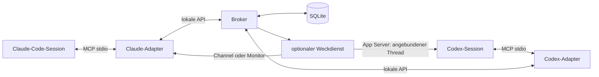

# Kommunikation zwischen Claude-Code- und Codex-Sessions

**Update 19. September:** Der native Standardzugang funktioniert für normale CLI-Starts/Resume bei vorhandenem stock Listener. Ohne diesen läuft die CLI intern; die Desktop-App bleibt separat. [Versionsgleicher Quell- und Live-Nachweis](codex-standard-endpoint.de.md)

**Vorschau 0.4.0:** Native Sitzungserkennung, Versandhelfer und automatischer Rückweg sind ergänzt und separat geprüft. Die installierten 0.3.0-Plugins wurden noch nicht ersetzt. [Aktueller Integrationsstand und Grenzen](native-integration.de.md)

Stand: 17. September 2026. Recherche und vorgeschlagene Architektur; kein bereits getestetes Produkt.

**Empfehlung:** Ein gemeinsamer lokaler Broker mit dauerhaften Postfächern, ein MCP-Server als gemeinsame Werkzeugoberfläche und zwei schlanke Plugin-Adapter. Automatisches Aufwecken bleibt eine separat ausgewiesene Fähigkeit des jeweiligen Adapters.

Die Annahme für den ersten Entwurf ist: ein Benutzer, ein Rechner, mehrere unabhängig gestartete Sessions, Claude Code CLI und Codex App/CLI. Betriebssystem ist zunächst natives Windows. Ein Rechner mit WSL ist aus Sicht von Netzwerk, Prozessverwaltung und Dateipfaden bereits ein Integrationsfall mit zwei Umgebungen.

**Update 18. September 2026:** Die folgende Recherche beschreibt den ursprünglichen Entwurf. Inzwischen sind native Claude-Zustellung und Codex-Delegation über einen eigenen App-Server samt Windows-Control-Socket experimentell nachgewiesen. Der fehlende UserInput-Typ externalMessage schließt den belegten toolOutput-Eingang nicht aus. [Nachweis, Grenzen und nächste Schritte](native-delivery-proof.de.md)

## 1. Was aktuell belegt ist

### Claude Code

Claude hat inzwischen eigene Kommunikation zwischen unabhängigen Sessions: `ListAgents` entdeckt andere Sessions, `SendMessage` adressiert sie. Natives Windows wird ab 2.1.234 unterstützt; lokal verwendet Claude dort Named Pipes. WSL und Windows erreichen sich über diese lokale Funktion nicht unmittelbar. Das ist für reine Claude-Kommunikation eine vorhandene Alternative. Eine dokumentierte allgemeine Drittanbieter-Sende-API für Codex ergibt sich daraus nicht. [Claude Cross-session messaging](https://code.claude.com/docs/en/cross-session-messaging)

Channels bringen externe Ereignisse über einen MCP-Server in eine offene Claude-Session. Sie sind Research Preview, erfordern Aktivierung und unterliegen einer Plugin-Allowlist; für eigene Entwicklung existiert ein gesonderter Entwicklungsmodus. Provider und Organisationsrichtlinien begrenzen die Verfügbarkeit. [Channels](https://code.claude.com/docs/en/channels)

Der technische Vertrag verwendet `capabilities.experimental['claude/channel']` und `notifications/claude/channel` über stdio. Die erfolgreiche Übertragung bestätigt nur das Schreiben auf den Transport. Sie bestätigt weder Aufnahme noch Verarbeitung durch Claude. Deshalb braucht unsere Anwendung eigene Empfangsbestätigungen. [Channels reference](https://code.claude.com/docs/en/channels-reference)

Eine zweite Push-Option sind experimentelle Plugin-Monitore: Ein Prozess liefert Ereignisse über stdout. Sie laufen in interaktiven CLI-Sessions und hängen von der Verfügbarkeit des Monitor-Werkzeugs ab. Die Plugin-Struktur umfasst `.claude-plugin/plugin.json`, `.mcp.json`, Skills und Hooks. [Plugins reference](https://code.claude.com/docs/en/plugins-reference)

Monitor ist unter anderem bei bestimmten Providern sowie bei gesetztem `DISABLE_TELEMETRY` oder `CLAUDE_CODE_DISABLE_NONESSENTIAL_TRAFFIC` nicht verfügbar. Diese Option muss deshalb erkannt und getestet werden; sie darf keine Voraussetzung für normale Postfächer sein. [Tools reference](https://code.claude.com/docs/en/tools-reference#monitor-tool)

### Codex

Codex dokumentiert MCP über stdio und Streamable HTTP. Desktop, CLI und IDE teilen die MCP-Konfiguration. Das ist eine gute gemeinsame Basis für unsere Werkzeuge. [Codex MCP](https://learn.chatgpt.com/docs/extend/mcp?surface=cli)

Hooks können bei Session-Start, Benutzereingabe und Werkzeugaufrufen laufen und Kontext ergänzen. Plugin-Hooks werden unterstützt; nicht verwaltete Hooks benötigen die vorgesehene Vertrauensprüfung. Ein Hook reagiert auf ein Lebenszyklusereignis. Daraus folgt kein allgemeiner externer Weckmechanismus für eine bereits wartende Session. Die Dokumentation warnt außerdem davor, das Transcript-Format als stabile Schnittstelle zu verwenden. [Codex Hooks](https://learn.chatgpt.com/docs/hooks)

Der App Server bietet `turn/start` und `turn/steer`; Steering benötigt die aktuelle `expectedTurnId`. Damit können wir erreichbare, explizit angebundene Threads steuern. Ein neu gestarteter App Server übernimmt aber nicht nachweislich eine beliebige laufende Desktop-Session. Transport und Thread-Zuordnung müssen separat nachgewiesen werden. App Server und insbesondere WebSocket-Transport sind experimentell. [Codex App Server](https://learn.chatgpt.com/docs/app-server)

Normale MCP-Logmeldungen sind keine portable Alternative: `notifications/message` ist im MCP-Vertrag Logging; die Darstellung ist dem Client überlassen. Wir sollten daraus weder Modellkontext noch automatisches Weiterarbeiten ableiten. [MCP Logging](https://modelcontextprotocol.io/specification/2026-07-28/server/utilities/logging)

### Lokal überprüft

Der Arbeitsordner war leer und noch kein Git-Repository. Die folgenden Abfragen wurden ohne Modellaufrufe ausgeführt:

| Prüfung | Ergebnis |
|---|---|
| `claude --version` | `2.1.274` |
| `codex --version` | `0.155.0-alpha.2.6` |
| `node --version` | `v22.16.0` |
| Codex App-Server-Hilfe | stdio, WebSocket, Unix-Socket; außerdem Daemon- und Proxy-Unterbefehle |
| Generiertes lokales JSON-Schema | `TurnSteerParams` verlangt `threadId`, `expectedTurnId`, `input` |

Das Schema wurde mit `codex app-server generate-json-schema --experimental` in einem temporären Verzeichnis erzeugt. Der lokale `UserInput`-Typ enthält unter anderem Text, Bilder und Skills, aber keinen `externalMessage`-Variantentyp. Die CLI meldete zusätzlich eine Warnung zur Home-Verzeichnis-Erkennung im Ausführungskontext; die genannten Abfragen gelangen. Kein Agent wurde gestartet, keine fremde Session angesprochen und keine Installation verändert.

**Grenze der Prüfung:** Versions- und Schemaabfragen belegen keine funktionierende Zustellung. Insbesondere Desktop-Zugriff, Hook-Laufzeitverhalten und Channel-Aktivierung sind noch nicht Ende zu Ende getestet.

## 2. Optionen und vorhandene Projekte

| Ansatz | Nutzen | Grenze / Entscheidung |
|---|---|---|
| Native Session-Kommunikation | Wenig eigener Code für reine Anbieterwelt | Kein belegter gemeinsamer Claude–Codex-Vertrag |
| MCP + Postfächer | Gemeinsame Schnittstelle, persistente Nachrichten, einfache Diagnose | Empfänger muss abrufen oder angestoßen werden; Basis des MVP |
| MCP + Hooks | Nachrichtenhinweis bei ohnehin stattfindender Arbeit | Kein beliebiges Aufwecken aus dauerhaftem Leerlauf |
| Claude Channels / Monitore | Ereignisse erreichen offene Claude-Sessions | Preview, Verfügbarkeit und Empfang gesondert testen |
| Eigener Session-Controller | Kontrollierter Start, Eingabe und Ereignisstrom | Verändert den Start-Workflow; sinnvoll für garantierte autonome Verarbeitung |
| Dateien als Bus | Kleiner Proof of Concept | Konkurrenzzugriffe, Identität und Quittierungen werden schnell eigener Broker-Code |
| Terminal-/tmux-Eingaben | Schnelle Demonstration möglich | Fokus, Promptzustand, Escape-Sequenzen und Windows machen dies ungeeignet als Produktbasis |
| A2A-Gateway | Spätere Integration weiterer Agentensysteme | Löst den Einstieg in offene CLI-/Desktop-Sessions nicht automatisch |

A2A standardisiert Zusammenarbeit zwischen Agenten einschließlich länger laufender Aufgaben. Für unser lokales MVP wäre es eine zusätzliche Schicht; später lässt sich der Broker darüber erreichbar machen. [A2A introduction](https://a2a-protocol.org/latest/topics/what-is-a2a/)

Drei relevante Referenzimplementierungen:

| Projekt | Dokumentierter Ansatz | Bewertung für uns |
|---|---|---|
| [Co-Messi/agent-peers-mcp](https://github.com/Co-Messi/agent-peers-mcp) | Claude-/Codex-MCP-Adapter, lokaler Broker, SQLite, Lease/ACK, verwalteter Codex-App-Server zum Aufwecken | Fachlich am nächsten; erster Kandidat für einen Wiederverwendungs-Spike. Windows-Kompatibilität und aktuelle Host-Versionen selbst prüfen. |
| [Dicklesworthstone/mcp_agent_mail](https://github.com/Dicklesworthstone/mcp_agent_mail) | HTTP-FastMCP, Identitäten, Postfächer, Threads, SQLite/Git und freiwillige Dateireservierungen | Geeignet, wenn Koordination und Historie wichtiger werden; größerer Umfang als unser Einstieg. |
| [osteele/agent-mail](https://github.com/osteele/agent-mail) | Lokale dauerhafte Mail, MCP, Claude-Channel-Push und optionale Zusatzdienste | Gute Referenz für Postfächer; laut README ist Windows nicht unterstützt. |

Diese Bewertung beruht auf den Projektquellen, nicht auf Installation, Code-Audit oder Benchmark. Teilweise stehen ältere Einschränkungen neben neueren Funktionen in READMEs. Für Produktfähigkeiten haben die aktuellen Herstellerdokumente und eigene Tests Vorrang.

**Build-or-reuse-Entscheidung:** Zuerst `agent-peers-mcp` gegen unseren Windows- und Desktop-Testkatalog prüfen. Wenn Identität, Verpackung und Zustellung passen, erweitern. Falls dafür zentrale Annahmen ersetzt werden müssten, einen kleinen eigenen Kern umsetzen. Vor Codeübernahme die konkrete Revision und ihre Lizenz prüfen.

## 3. Vorgeschlagene Architektur



Das Diagramm beschreibt den Zielentwurf. Die Weckpfade sind optionale Integrationen.

Der Broker verwaltet Registrierung, Postfächer, Zugriffsrechte, Quittierungen und Zustellversuche. Ausschließlich er schreibt in SQLite. Die Plugins enthalten Werkzeuge, Anweisungen und die jeweilige Host-Anbindung. Der Kern kennt keine Claude- oder Codex-Promptformate.

Vorgeschlagener Stack: TypeScript, eine festgelegte unterstützte Node-LTS-Version, offizielles MCP-SDK und SQLite. Die konkrete SQLite-Bibliothek wählen wir nach einem Windows-Paketierungstest. Ein Runtime-Upgrade oder native Build-Werkzeuge dürfen nicht unbemerkt Voraussetzung werden. Für diesen Entwurf wurden keine Dependencies installiert.

Für das MVP genügt eine Loopback-HTTP-API mit authentisierten POST-Aufrufen und einem SSE-Ereignisstrom zwischen Broker und Adaptern. Das ist unsere interne API, unabhängig vom MCP-Transport zum Host. Ein MCP-Adapter verbindet sich per stdio mit Claude/Codex. Später sind Named Pipes und Unix-Sockets alternative interne Transporte.

Ein einzelner Broker pro Betriebssystembenutzer nutzt ein dauerhaftes Datenverzeichnis, unter Windows beispielsweise `%LOCALAPPDATA%/AgentSessionMessaging`. Daten liegen außerhalb der versionierten Plugin-Verzeichnisse. Neustarts, Plugin-Updates und mehrere gleichzeitig startende Adapter dürfen keine neuen getrennten Postfächer erzeugen. Die Startlogik braucht eine exklusive Sperre, eine Instanzkennung und eine Bereitschaftsprüfung; ein offener Port allein reicht nicht.

## 4. Identität und Sitzungserkennung

Das größte Integrationsrisiko ist die eindeutige Zuordnung eines Werkzeugaufrufs zu einem Gespräch. Weder Arbeitsverzeichnis noch Anzeigename noch MCP-Verbindung allein sind dafür ausreichend.

Vorgeschlagenes Modell:

```text
Endpoint
  endpointId          vom Broker vergebene dauerhafte Identität
  displayName         frei wählbarer, nicht eindeutiger Anzeigename
  provider            claude-code | codex
  hostId              registrierte Ausführungsumgebung
  workspaceId         explizite Projektidentität
  nativeThreadId      nur bei verifizierter Host-Zuordnung
  nativeSessionId     zusätzlich, nicht als Ersatz für nativeThreadId
  incarnationId       aktuelle Laufzeitinstanz
  capabilities        pull, hook-notify, push, wake, steer
  status              available | busy | waiting-approval | offline
```

Bei Codex kann `thread.sessionId` mehrere geforkte Threads verbinden; Hooks für Subagents können die ID des Elternkontexts liefern. Der Adapter muss deshalb den wirklichen Zielthread und seine Laufzeitbindung prüfen. [App-Server-Identitäten](https://learn.chatgpt.com/docs/app-server), [Hook-Eingaben](https://learn.chatgpt.com/docs/hooks)

Vorgehen:

1. Eigene Launcher/Controller kennen den nativen Thread und binden ihn explizit an den Broker.
2. In unabhängig geöffneten Sessions verwenden wir geprüfte Hook-/Host-Metadaten. Nicht dokumentierte Umgebungsvariablen werden nicht vorausgesetzt.
3. Wo eine eindeutige automatische Zuordnung fehlt, erfolgt explizite Anmeldung eines Postfachs im Gespräch. Ein zufälliger, gesprächsspezifischer Handle begleitet weitere Toolaufrufe. Das ermöglicht Postfächer, aber keinen behaupteten Zugriff auf den nativen Thread.
4. Kann der Adapter mehrere Gespräche nicht sicher auseinanderhalten, meldet er den Konflikt und deaktiviert automatische Zustellung. Kein Raten anhand von `cwd` oder zuletzt aktivem Fenster.

Wiederaufnahme verlangt einen Besitznachweis für die Postfachidentität; derselbe Anzeigename genügt nicht. Neue Forks bekommen eigene Postfächer. Heartbeats betreffen die laufende Instanz; eine Offline-Session verliert dadurch nicht ihre wartenden Nachrichten.

## 5. MCP-Werkzeuge und Nachrichtenvertrag

Vorgeschlagene Werkzeuge, noch keine vorhandene API:

| Werkzeug | Aufgabe |
|---|---|
| `session_register` | Explizite Anmeldung, falls Host-Bindung fehlt |
| `sessions_list` | Erreichbare und berechtigte Empfänger samt Fähigkeiten finden |
| `message_send` | Nachricht dauerhaft annehmen und ID zurückgeben |
| `inbox_read` | Begrenzte Nachrichtenmenge abrufen; nichts beim Lesen löschen |
| `message_ack` | Empfang explizit bestätigen, idempotent |
| `message_reply` | Antwort mit Bezug auf eine existierende Nachricht senden |
| `message_status` | Gespeichert, angeboten, bestätigt, fehlgeschlagen unterscheiden |

Registrierung, Heartbeats und interne Lease-Erneuerung sollten möglichst ohne Modellaufrufe im Adapter laufen. Ein optionales `inbox_wait` erhält ein kurzes, begrenztes Timeout; endlose Toolaufrufe ersetzen keinen Weckdienst.

Beispiel eines vom Broker gespeicherten Umschlags:

```json
{
  "schemaVersion": 1,
  "messageId": "msg_01",
  "workspaceId": "workspace_01",
  "fromEndpointId": "endpoint_claude_01",
  "toEndpointId": "endpoint_codex_01",
  "conversationId": "conversation_01",
  "inReplyTo": null,
  "kind": "request",
  "body": "Bitte prüfe die API-Änderung in Commit abc123.",
  "createdAt": "2026-09-17T12:00:00Z",
  "expiresAt": "2026-09-18T12:00:00Z",
  "idempotencyKey": "review-api-abc123"
}
```

Der Broker setzt den authentisierten Absender. Ein Toolargument darf keine fremde Absenderidentität behaupten. Anzeigenamen lösen wir vor dem Senden auf eine stabile ID auf; Mehrdeutigkeit führt zu einer Auswahl, nicht zu Broadcast.

Die Zustellung erfolgt mindestens einmal innerhalb der konfigurierten Frist und Wiederholungsregeln. Eindeutige IDs und Idempotenzschlüssel verhindern doppelte Speicherung derselben Sendewiederholung. Lease und ACK verhindern konkurrierende Verarbeitung; Abstürze können dennoch erneute Präsentation auslösen. Genau-einmal-Ausführung beliebiger Agentenaktionen wird nicht versprochen.

Ein sinnvolles Statusmodell ist `queued → offered → acknowledged`; `replied`, `expired` und `failed` sind zusätzliche Ergebnisse. `acknowledged` bestätigt einen expliziten Empfängeraufruf, keinen erfolgreichen Code-Review. Für fachliche Ergebnisse gibt es Antworten.

## 6. Wie die Nachricht im Gespräch ankommt

**Basismodus:** Beide Hosts können mit MCP senden und abrufen. Ein Skill erklärt Empfängerauswahl, Antworten und Quittierung. Skills allein erzwingen kein regelmäßiges Abrufen.

**Hook-Modus:** Bei einem passenden Lifecycle-Ereignis prüft ein kurzer Hook auf neue IDs und meldet nur Anzahl und Abrufhinweis. Die Nachricht selbst kommt anschließend aus dem MCP-Tool. Das vermeidet, fremden Nachrichtentext ungeprüft in höher priorisierten Hook-Kontext einzubauen. Hooks werden gedrosselt und lösen keine rekursiven Messaging-Hooks aus.

**Claude-Push:** Ein Channel oder verfügbarer Plugin-Monitor signalisiert neue Nachrichten. Der Broker bleibt die maßgebliche Ablage; verlorene Signale führen nicht zu verlorenen Nachrichten. Channel und Monitor werden nicht gleichzeitig als unabhängige Zustellwege aktiviert, sofern sie denselben Eingang mehrfach anbieten würden.

**Codex-Aufwecken:** Ein optionaler Controller arbeitet nur mit explizit registrierten, erreichbaren App-Server-Threads. Im Leerlauf sendet er über `turn/start` einen festen Hinweis wie „Im registrierten Postfach liegen neue Nachrichten; rufe inbox_read auf“. Der Nachrichtentext wird erst als Toolergebnis geliefert. Bei laufender Arbeit warten wir zunächst auf den nächsten sicheren Zeitpunkt. `turn/steer` bleibt eine spätere, explizite Option.

Dafür braucht es Zustandsprüfung, genau einen Controller pro Thread, Erkennung zwischenzeitlich gestarteter Benutzer-Turns und Wiederholungsgrenzen. Bei unklarem Sendeausgang darf kein blindes erneutes Starten erfolgen. Wartende Berechtigungsdialoge und Benutzerabbrüche werden respektiert. Das Plugin bestätigt eine Nachricht niemals stellvertretend für den Empfänger.

Für beliebige bereits laufende Codex-Desktop-Sessions ist dieser Weckpfad noch offen. Lokale App-Werkzeuge zur Task-Kommunikation sind in dieser Codex-Umgebung vorhanden, aber dadurch nicht automatisch als öffentliche externe Plugin-API verfügbar. Einen Zugriff darauf sollten wir nur als optionalen Host-Adapter vorsehen.

Für vollständig von uns gestartete Agenten ist außerdem ein Controller mit Claude Agent SDK und Codex SDK/App Server möglich. Claudes Streaming-Input eignet sich für eine kontrollierte Eingabewarteschlange; Resume setzt eine gespeicherte Session fort, ist aber kein Beleg für das Anhängen an einen fremden laufenden Prozess. [Claude Streaming Input](https://code.claude.com/docs/en/agent-sdk/streaming-vs-single-mode), [Claude Sessions](https://code.claude.com/docs/en/agent-sdk/sessions), [Codex SDK](https://learn.chatgpt.com/docs/codex-sdk)

## 7. Paketstruktur

Vorgeschlagene Quellstruktur:

```text
agent-session-messaging-plugin/
  packages/
    protocol/                 Schemas, Fehlercodes, Versionsvertrag
    broker/                   lokale API, SQLite, Queues, Identitäten
    mcp-server/               gemeinsame MCP-Werkzeuge
    adapters/
      claude/                 Hooks, optional Channels/Monitore
      codex/                  Hooks, optional App-Server-Controller
    cli/                      doctor, sessions, send, inbox
  plugins/
    claude/agent-session-messaging/
      .claude-plugin/plugin.json
      .mcp.json
      hooks/hooks.json
      skills/session-messaging/SKILL.md
      dist/
    codex/agent-session-messaging/
      plugin.json
      mcp.json
      .codex-plugin/plugin.json
      hooks/hooks.json
      skills/session-messaging/SKILL.md
      dist/
  tests/
    integration/
    host-compatibility/
  docs/
```

Die aktuelle OpenAI-Dokumentation empfiehlt das portable Root-Manifest `plugin.json` mit `mcp.json`. `.codex-plugin/plugin.json` bleibt als Kompatibilitätsformat unterstützt. Das portable MCP-Format und `.mcp.json` sind nicht durch bloßes Umbenennen austauschbar. [OpenAI Plugin Packaging](https://developers.openai.com/plugins/build/plugins)

Wir generieren die zwei Distributionspakete aus gemeinsamen Quellen. Falls ein älterer Zielhost ausschließlich das Kompatibilitätsformat braucht, erzeugt der Build die passende Konfiguration. Komponenten werden nicht doppelt registriert. Der lokale Plugin-Creator validiert bisher das Kompatibilitätsformat; portable Manifeste benötigen zusätzlich deren Schema-Prüfung.

Die `dist/`-Dateien müssen innerhalb jedes installierbaren Pakets liegen. Verweise auf `../../packages` funktionieren nach Kopieren in einen Plugin-Cache nicht zuverlässig. Host-spezifische Hooks und Umgebungsvariablen bleiben getrennt. Die Plugin-Version und die Broker-Protokollversion sind unterschiedliche Dinge.

Für Windows: Prozesse mit Argumentarrays starten; Leerzeichen und Unicode in Pfaden testen; keine Bash-, tmux- oder `chmod`-Voraussetzung. Ein optionaler Broker-Autostart erfolgt später über den Installer. Der erste Entwicklungsschritt startet ihn ausdrücklich im Vordergrund und lässt sich leicht beenden.

## 8. Notwendige Grenzen im Entwurf

Die lokale API bindet ausschließlich an Loopback und prüft ein zufälliges Installationsgeheimnis sowie registrierte Session-Berechtigungen. Unter Windows gehören restriktive ACLs zum Datenverzeichnis. Das schützt vor versehentlichem Zugriff und anderen Benutzern; Prozesse mit denselben Benutzerrechten sind keine vollständig getrennte Sicherheitsdomäne.

Sessions sehen standardmäßig nur ihre freigegebene Projektgruppe. Projektübergreifende Kommunikation ist eine explizite Einstellung. Der Inhalt einer Nachricht ist Text eines anderen Agenten und keine Benutzerfreigabe. Der Broker führt daraus weder Shell-Befehle aus noch beantwortet er Berechtigungsdialoge.

Für den Einstieg: Direktnachrichten und Antworten, kleine Textnachrichten, Größenlimits und begrenzte Retention. Automatische Antwortschleifen begrenzen wir durch Budgets pro Konversation, maximale automatische Folgeaktionen, Cooldown und terminale Ergebnisnachrichten. Empfangsquittungen werden technisch verarbeitet und lösen keine neue Modellantwort aus.

Dateireservierungen sind eine spätere, freiwillige Koordinationsfunktion. Sie ersetzen weder Git-Worktrees noch tatsächliche Dateisperren. Vollständige Transkripte werden nicht automatisch geteilt; ein Commit oder gezielt ausgewählter Ausschnitt reicht für viele Übergaben.

## 9. Produktziel und nächste Phase

Präzisierung durch den Benutzer am 17. September 2026: Dauerhafte Nutzung darf keinen Start von Sessions über `npm run …` erfordern. Die npm-Skripte dienen ausschließlich der Entwicklung und lokalen Prüfung. Ziel ist eine einmalige Plugin-Installation; danach werden Claude Code und Codex über ihre gewohnten Oberflächen gestartet. Ein eigenes Terminal-Frontend ist kein vorausgesetzter Produktworkflow.

Version 0.2.0 setzt installierbare Plugin-Pakete und einen gemeinsam genutzten Broker um, der bei Bedarf im Hintergrund startet. Paketkopien außerhalb des Repositories, gleichzeitiger Start und Wiederanlauf nach Absturz sind automatisiert geprüft; die normale Host-Integration wird separat über die installierten Plugins geprüft. Parallel startende Adapter müssen dieselbe Broker-Instanz finden; Updates müssen bestehende Postfächer erhalten. Explizite CLI-Befehle für Diagnose und Entwicklung bleiben optional.

Automatisches Aufwecken ist davon getrennt: Claude Channels und Codex-Integration müssen im jeweiligen normalen Host geprüft werden. Der Benutzer hat für diese Phase ausdrücklich auf den Automatikmodus verzichtet. Ein eigener Codex-App-Server-Controller wird deshalb nicht implementiert. Automatisches Aufwecken beliebiger bestehender Codex-CLI-/Desktop-Sessions ist weiterhin nicht nachgewiesen. Wo der Host keinen geeigneten Einstieg bietet, bleiben Abrufen beziehungsweise Hinweise bei Aktivität die ehrlich ausgewiesene Fähigkeit.

## 10. Implementierungsreihenfolge und Abnahmekriterien

| Schritt | Lieferumfang | Abnahme |
|---|---|---|
| 0: Integration prüfen | Kleine Wegwerf-Prototypen für Identität, Hooks, Channel und Codex-Controller; bestehendes Projekt vergleichen | Zwei Sessions im selben Ordner bleiben unterscheidbar. Ergebnis dokumentiert Pull, Push und Wake getrennt. |
| 1: Broker und Protokoll | SQLite, Registrierung, Send/Read/ACK/Reply, CLI | Parallele Sender, Neustart, doppelte Sendung, abgelaufene Lease, Offline-Empfänger und fehlende Berechtigung funktionieren reproduzierbar. |
| 2: Beide Plugin-Pakete | MCP-Werkzeuge, Skills, geprüfte Hooks | Claude sendet an Codex; Codex liest und antwortet. Gegenrichtung ebenfalls, mit korrekten Absendern. |
| 3: Normale Plugin-Nutzung | Installierbare Pakete, Plugin-Cache-Prüfung, Broker-Hintergrundstart, Diagnose und Deinstallation | Nach einmaliger Installation normale Host-Starts ohne npm; parallele Starts teilen einen Broker; Updates erhalten Postfächer. |
| 4: Ereigniszustellung | Claude-Push; Codex-Zustellung innerhalb nachgewiesener Host-Schnittstellen | Offene wartende Session reagiert im unterstützten Modus ohne manuelle Eingabe; Broker-Neustart verliert keine Nachricht; ein eigener Session-Controller bleibt optional. |
| 5: Erweiterungen | Mehrere Rechner, A2A, Dashboard, Dateireservierungen | Erst nach stabiler lokaler Zustellung und nachgewiesenem Bedarf. |

Der erste Spike muss zusätzlich prüfen: Fork/Resume, mehrere Codex-Desktop-Tasks, gleichzeitige MCP-Verbindungen, Hook-Start vor MCP-Bereitschaft, Claude-Channel ohne Aktivierung sowie Pfade mit Leerzeichen. Fehlende Fähigkeiten müssen sichtbar sein, beispielsweise `delivery: pull-only` statt einer falschen Erfolgsmeldung.

Die Integrationssuite simuliert Abstürze vor und nach Speicherung/ACK. Für tatsächliche Host-Kompatibilität ergänzen wir wenige kontrollierte Ende-zu-Ende-Läufe auf festgehaltenen Versionen. Eine grüne Broker-Testsuite allein belegt keine erfolgreiche Modellzustellung.

**Erstes nutzbares Ziel:** Zwei unabhängig gestartete Sessions auf Windows können sich entdecken, dauerhaft Nachrichten senden, abrufen und beantworten. Anschließend erweitern wir die nachgewiesenen Hosts um automatische Zustellung. Falls automatisches Aufwecken beliebiger bestehender Desktop-Sessions zwingend ist, muss Schritt 0 genau diese Machbarkeit belegen, bevor der übrige Umfang ausgebaut wird.
